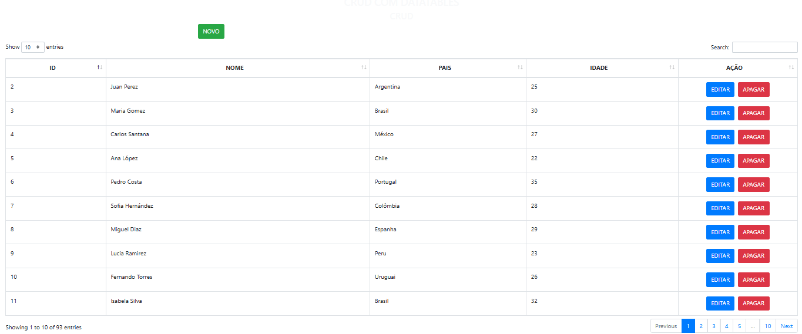
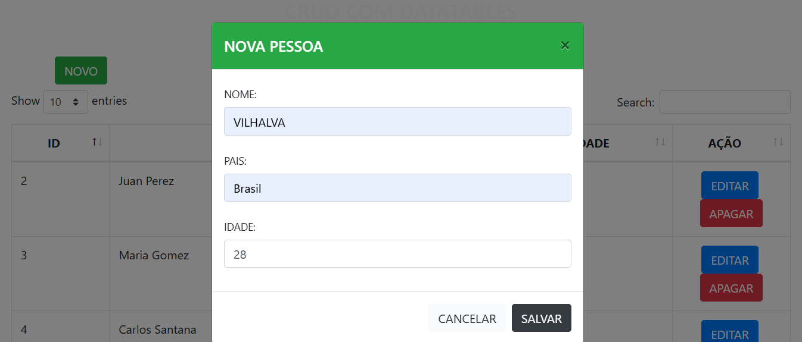
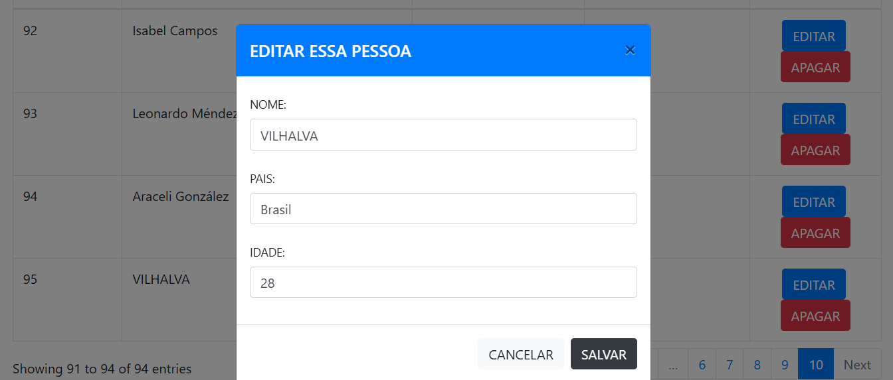
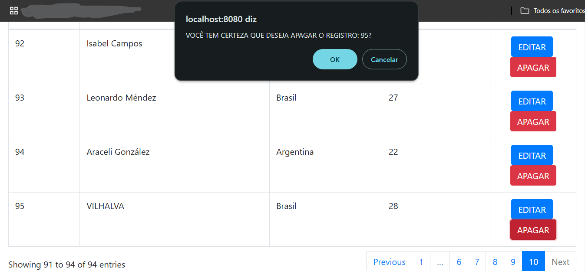
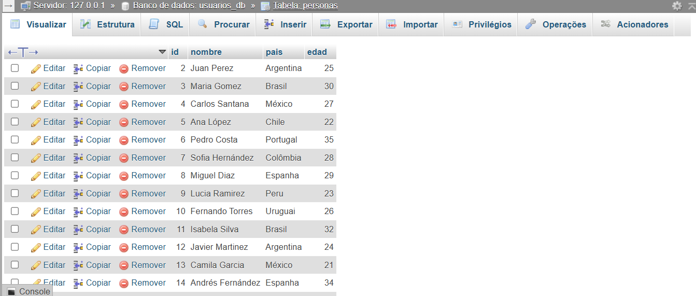

# CRUD PHP COM DATATABLES
👨‍🏫CRUD EM PHP, MYSQL, DATATABLES, BOOTSTRAP E JQUERY.

 <br>
 <br>
 <br>
 <br>
 <br>

## DESCRIÇÃO:
Este projeto é uma aplicação web que permite gerenciar informações de pessoas de forma simples e organizada. Os dados armazenados incluem:  

- **Nome:** O nome completo de uma pessoa.  
- **País:** O país de origem ou residência da pessoa.  
- **Idade:** A idade atual da pessoa em anos.  

A aplicação fornece uma interface intuitiva onde é possível:  

1. **Adicionar Pessoas:** Inserir novas informações de indivíduos.  
2. **Editar Dados:** Atualizar informações previamente cadastradas, como corrigir erros ou alterar dados desatualizados.  
3. **Excluir Registros:** Remover permanentemente informações que não sejam mais necessárias.  
4. **Visualizar Pessoas:** Consultar todos os registros de forma organizada e interativa.  

## EXECUTANDO O PROJETO:
1. **Configuração do Banco de Dados:**
   - Antes de executar o site, é necessário importar o arquivo `./DATABASE/DATABASE.sql`. 

2. **Configuração do PHP:**
   - Abra o arquivo `./CODIGO/bd/conexion.php` e ajuste as configurações do banco de dados:

     ```php
     define('servidor', 'localhost');
     define('nombre_bd', 'usuarios_db');
     define('usuario', 'seu_usuario');
     define('password', 'sua_senha');
     ```

3. **Executando o Aplicativo com Apache:**
   - Coloque os arquivos em um servidor web compatível com PHP (por exemplo, XAMPP, WAMP, LAMP).
   - Acesse o formulário no navegador visitando [http://localhost/CODIGO/index.html](http://localhost/CODIGO/index.html).

4. **Executando o Aplicativo com `php.exe`:**
   - Alternativamente, você pode iniciar o servidor diretamente no diretório `./CODIGO` com o comando abaixo:
   ```bash
   php -S localhost:8080
   ```
   - Em seguida, acesse o formulário no navegador através do endereço: [http://localhost:8080](http://localhost:8080).

5. **Use a interface para gerenciar os registros:**
   - Clique em `NOVO`, e coloque o `NOME`, `PAIS` e `IDADE` para criar um novo registro.
   - Utilize o botão `EDITAR` na tabela para atualizar informações.
   - Clique em `APAGAR` para remover o registro (com confirmação).

## NÃO SABE?
- Entendemos que para manipular arquivos em `HTML`, `CSS` e outras linguagens relacionadas, é necessário possuir conhecimento nessas áreas. Para auxiliar nesse aprendizado, oferecemos cursos gratuitos disponíveis:
* [CURSO DE HTML E CSS](https://github.com/VILHALVA/CURSO-DE-HTML-E-CSS)
* [CURSO DE PHP](https://github.com/VILHALVA/CURSO-DE-PHP)
* [CURSO DE JAVASCRIPT](https://github.com/VILHALVA/CURSO-DE-JAVASCRIPT)
* [CURSO DE JQUERY](https://github.com/VILHALVA/CURSO-DE-JQUERY)
* [CURSO DE BOOTSTRAP](https://github.com/VILHALVA/CURSO-DE-BOOTSTRAP)
* [CURSO DE MYSQL](https://github.com/VILHALVA/CURSO-DE-MYSQL)
* [CURSO DE PHP COM MYSQL](https://github.com/VILHALVA/CURSO-DE-PHP-COM-MYSQL)
* [CONFIRA MAIS CURSOS](https://github.com/VILHALVA?tab=repositories&q=+topic:CURSO)

## CREDITOS:
- [PROJETO CRIADO PELO "jose8951"](https://github.com/jose8951/crud_2019_ok)
- [PROJETO MODIFICADO PELO VILHALVA](https://github.com/VILHALVA)


